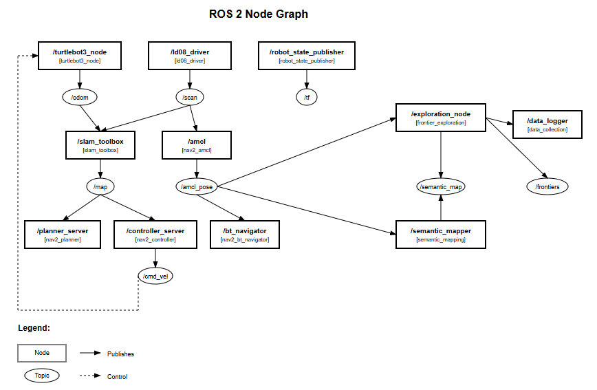

# TurtleBot3 Semantic Autonomy Simulation

[](https://docs.ros.org/en/humble/)
[](LICENSE)
[](http://gazebosim.org/)
[](https://www.python.org/)

A comprehensive autonomous exploration and semantic mapping system for TurtleBot3 robots using ROS 2 and OpenAI-CLIP. This project combines frontier-based exploration, semantic room classification, and RRT-based navigation in office environments.

The first launch file 'office_exploration_launch.py', explore the environment and save the pose data after the room classification. Then 'office_navigation_launch.py', navigate to a room pose data based on the output of exploration launch and a query to the CLIP model.

## 🚀 Features

- **Autonomous Exploration**: Frontier-based exploration with intelligent obstacle avoidance
- **Semantic Mapping**: Real-time room classification (office, reception, meeting room, etc.)
- **Data Logging**: Exploration data collection on room's coordinate
- **Navigation**: Semantic-aware navigation with location management
- **Multi-Sensor Fusion**: LIDAR-based mapping with vision integration
- **Real-time Monitoring**: Live exploration progress tracking and status monitoring
- **Persistent Storage**: SQLite database for semantic map storage
- **Interactive Interface**: Query system for semantic location information

## 🏗️ System Architecture



LIDAR + odometry → SLAM creates map → Detect the frontiers -> Navigation plans paths → Sends commands to robot → Use the pose data for semantic mapping.

## 📋 Requirements

### System Requirements
- **OS**: Ubuntu 22.04 LTS (or WSL2)
- **ROS**: ROS 2 Humble Hawksbill
- **Python**: 3.10+
- **Gazebo**: 11.x
- **RAM**: 4GB minimum, 8GB recommended
- **CPU**: Multi-core recommended for real-time performance (or might want to use GPU instead)

### ROS 2 Dependencies
```bash
# Core dependencies
sudo apt install ros-humble-desktop-full
sudo apt install ros-humble-gazebo-ros-pkgs
sudo apt install ros-humble-turtlebot3-gazebo
sudo apt install ros-humble-navigation2
sudo apt install ros-humble-nav2-bringup
sudo apt install ros-humble-slam-toolbox
sudo apt install ros-humble-tf2-tools
```

### Python Dependencies
```bash
# Required Python packages
pip install numpy opencv-python sqlite3 torch torchvision
pip install open-clip-torch pillow 
```

## 🛠️ Installation

### 1. Clone the Repository
```bash
# Create ROS 2 workspace
mkdir -p ~/gfl_autonomy_ws/src
cd ~/gfl_autonomy_ws/src

# Clone the project
git clone https://github.com/yourusername/turtlebot3_autonomy.git
```

### 2. Install Dependencies
```bash
# Install ROS 2 dependencies
cd ~/gfl_autonomy_ws
rosdep install --from-paths src --ignore-src -r -y

# Install Python dependencies
pip install -r src/turtlebot3_autonomy/requirements.txt
```

### 3. Build the Workspace
```bash
# Source ROS 2
source /opt/ros/humble/setup.bash

# Build the package
cd ~/gfl_autonomy_ws
colcon build --packages-select turtlebot3_autonomy

# Source the workspace
source install/setup.bash
```

### 4. Environment Setup
```bash
# Add to ~/.bashrc for permanent setup
echo "source /opt/ros/humble/setup.bash" >> ~/.bashrc
echo "source ~/gfl_autonomy_ws/install/setup.bash" >> ~/.bashrc
echo "export TURTLEBOT3_MODEL=burger_cam" >> ~/.bashrc
echo "export GAZEBO_MODEL_PATH=~/gfl_autonomy_ws/src/turtlebot3_autonomy/models" >> ~/.bashrc

# Reload terminal
source ~/.bashrc
```

## 🚀 Usage

### Quick Start
```bash
# Launch the complete autonomous exploration system
ros2 launch turtlebot3_autonomy office_exploration_launch.py
```

This single command starts:
- Gazebo simulation with office environment
- TurtleBot3 robot with camera and LIDAR
- SLAM Toolbox for mapping
- Navigation2 stack for path planning
- Semantic mapping system
- Autonomous exploration
- Data logging and monitoring
- RViz visualization

```bash
# Launch the autonomous navigation system based on queries
ros2 launch turtlebot3_autonomy office_navigation_launch.py
```
This single command starts:
- Gazebo simulation with office environment
- TurtleBot3 robot with camera and LIDAR
- SLAM Toolbox for mapping
- Navigation2 stack for path planning
- Query Semantic Input
- Monitor Exploration Progress
- RViz visualization

### Individual Components

#### 1. Basic Simulation
```bash
# Start just the Gazebo simulation
ros2 launch turtlebot3_gazebo turtlebot3_house.launch.py
```

#### 2. SLAM Only
```bash
# Start SLAM mapping
ros2 launch turtlebot3_autonomy slam_launch.py
```

#### 3. Navigation Only
```bash
# Start navigation stack
ros2 launch turtlebot3_autonomy office_navigation_launch.py
```

### Interactive Commands

#### Query Semantic Information
```bash
# Start the interactive query interface
ros2 run turtlebot3_autonomy interactive_query_interface

# Or use command line queries
ros2 service call /semantic_query turtlebot3_autonomy_msgs/srv/SemanticQuery "{query: 'find reception'}"
```

#### Monitor Exploration Progress
```bash
# Check exploration status
ros2 topic echo /exploration_status

# View discovered locations
ros2 topic echo /semantic_locations
```

## 🎥 Video Documentation

### Demo Videos


## 👥 Credits

- **Author**: Amruyassar A 
- **Collaborator**: Raphael Lee
- **TurtleBot3**: [ROBOTIS](https://github.com/ROBOTIS-GIT/turtlebot3)
- **Nav2**: [ROS 2 Navigation Stack](https://navigation.ros.org/)
- **SLAM Toolbox**: [SteveMacenski/slam_toolbox](https://github.com/SteveMacenski/slam_toolbox)

